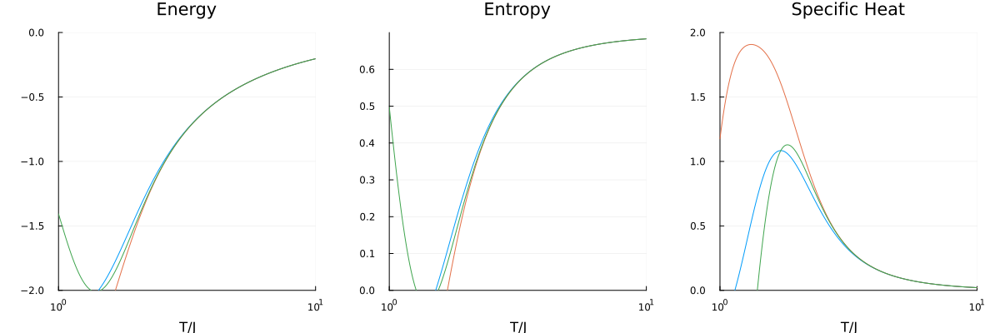

# Square Lattice

This example computes the linked cluster expansion on a square lattice up to
order 3.

## Setup

Define the unit cell with basis positions, primitive vectors, and
nearest-neighbour bonds:

```@example square
using Lincege

square_basis = [[0.0, 0.0]]
square_pvecs = [[1.0, 0.0], [0.0, 1.0]]
square_bonds = [Bond(1, 1, [1, 0], 1), Bond(1, 1, [0, 1], 1)]
square_uc = UnitCell(square_basis, square_pvecs, square_bonds, [1])
```

## Building the lattice and clusters

```@example square
m_order = 3
lattice = SiteExpansionLattice(m_order, square_uc)

trans_clusters = TranslationClusterSet(lattice)
clusters_from_lattice!(trans_clusters, lattice)

iso_clusters = IsomorphicClusterSet(lattice)
clusters_from_clusters!(iso_clusters, trans_clusters)

sym_clusters = SymmetricClusterSet(lattice, :Square)
clusters_from_clusters!(sym_clusters, trans_clusters)
```

## Computing the expansion

```@example square
expansion = Expansion(iso_clusters, lattice)
summation!(expansion, m_order)
```

## Printing Tables

There are three ways to print the standard tables one sees in papers regarding
NLCE.

`print_latex_table` outputs LaTeX source ready to paste into a paper:

```@example square
print_latex_table(expansion, [trans_clusters, iso_clusters, sym_clusters], m_order)
```

`print_html_table` renders the table in the browser:

```@example square
using Markdown
io = IOBuffer()
Lincege.print_html_table(io, expansion, [trans_clusters, iso_clusters, sym_clusters], m_order)
Markdown.HTML(String(take!(io)))
```

`print_ascii_table` prints a plain-text table:

```@example square
print_ascii_table(expansion, [trans_clusters, iso_clusters, sym_clusters], m_order)
```

## Writing to JSON

```@example square
json_path = joinpath(mktempdir(), "square_lattice.json")
write_to_json(expansion, lattice, json_path)
```

## Ising Model Simulation

```@example square
temperatures = collect(range(0.5, 5.0, length=200))

clusters = import_from_json(json_path)
solvers = [IsingSolver(c) for c in clusters]

nlce_result = perform_nlce(solvers, temperatures)
resummed = apply_resummations(nlce_result, [(:Euler, 2), (:Wynn, 1)])

# Specific heat from the highest bare order vs. the final resummed estimate
T_idx = argmax(temperatures .>= 2.0)
(temperature = temperatures[T_idx],
 bare = nlce_result.specific_heat[end][T_idx],
 resummed = resummed.specific_heat[end][T_idx])
```

## Plotting Results

```julia
using Plots

T = nlce_result.temperatures
n_orders = length(nlce_result.energy)

energy_cumsum  = hcat([sum(nlce_result.energy[1:n]) for n in 1:n_orders]...)
entropy_cumsum = hcat([sum(nlce_result.entropy[1:n]) for n in 1:n_orders]...)
cv_cumsum      = hcat([sum(nlce_result.specific_heat[1:n]) for n in 1:n_orders]...)

plot_range = max(1, n_orders - 2):n_orders
labels = reshape(["Order $n" for n in plot_range], 1, :)

p1 = plot(T, energy_cumsum[:, plot_range]; label=false, xlabel="T/J", title="Energy")
p2 = plot(T, entropy_cumsum[:, plot_range]; label=labels, xlabel="T/J", title="Entropy", legend=:top)
p3 = plot(T, cv_cumsum[:, plot_range]; label=false, xlabel="T/J", title="Specific Heat")

plot(p1, p2, p3; layout=(1, 3), size=(900, 300))
```

The following plot shows convergence of the NLCE up to order 10 for the square
lattice Ising model (J=1), note that the results plotted here are not directly
evaluted from the code above, but rather a cached result from a different
calculation:


